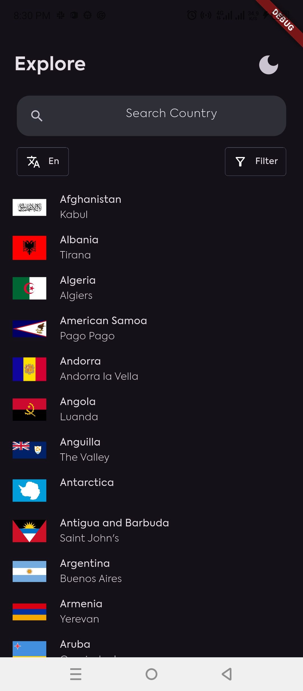

# country_info_app

This project is  a mobile application that allows users to view a list of countries, 
see detailed information about a selected country (such as states, country code, 
flag, and capital).
It also has light mode and dark mode.

### Possible Country Information
- Common Name
- Official Name
- Country code
- Independence Status
- Status
- UN Membership
- Currencies
- Capital
- Region
- Languages
- Translations
- Latitude and longitude
- LandLocked status
- Population
- Timezones
- Continents
- Flag
- Coat of Arms
- Start of the Week

## ✨ Features
- [✔] Filter countries based on continent
- [✔] Filter countries based on timezone
- [✔] Search for countries based on name
- [x] See country name in your preferred language


## 📸 ScreenShots

| Light                                                       | Dark                                                       |
|-------------------------------------------------------------|------------------------------------------------------------|
|    |    |
|  |  |


## Dependencies used
- [**cupertino_icons**](https://pub.dev/packages/cupertino_icons) - iOS-style icons
- [**provider**](https://pub.dev/packages/provider) - State management solution for configuring App theme
- [**dio**](https://pub.dev/packages/dio) - HTTP client for API calls
- [**cached_network_image**](https://pub.dev/packages/cached_network_image) - Efficient image caching and loading
- [**flutter_screenutil**](https://pub.dev/packages/flutter_screenutil) - Responsive UI design utilities
- [**intl**](https://pub.dev/packages/intl) - Internationalization and localization utilities


## Setup
- Clone the repository
  ```bash
  git clone https://github.com/LordOlumide/countries_app
  ```

- Install dependencies
  ```bash
  flutter pub get
  ```

- Run the app
  ```bash
  flutter run
  ```

## Platform compability
- Android
- iOS


## Contributing
We welcome contributions from anyone. To contribute to the project, please follow these steps:
- Fork the repository.
- Create a new branch for your feature or bugfix.
- Make your changes and commit them.
- Push your changes to your forked repository.
- Open a pull request against the main branch of this repository.

Please ensure that your code follows the project's coding standards and includes appropriate tests.
